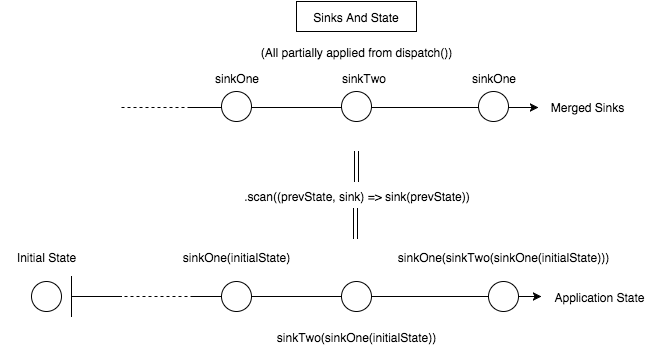

# Rx FRP Library - Readme

This is a simple utility library that bridges Rx streams a simple Function Reactive
workflow for integration with React or other view libraries.

The library exposes an FRP style with a single application state. Events are encapsulated and transformed into functions which operate and return a new state onto a 'state' stream that can be subscribed to and rendered in various ways.

The guts of the library are: The `dispatch()` function, and the `makeApp()` factory function which returns an application object with a lightweight API composed of three primary methods: `source`, `sink`, and `start`.

The library also exposes several utility functions for working with the application
object and Rx streams.

```
import {makeApp} from 'lib/framework.js';

var myApp = makeApp();
```

## Sources and Sinks

Sources and sinks both refer to Rx streams; Sources encapsulate interface events, while sinks encapsulate the side effects caused by those events. A source is a stream that can be `dispatch()`ed to, which is mapped into another Rx stream that is consumed by the application.

`dispatch()` is a function which takes a Source stream and emits arguments to it. Using
the Rx map function, we can turn a source into a sink by passing in a curried function which accepts state as its first argument, e.g.

```
var mySource = myApp.source();
var mySink   = mySource.map(function(state, anArgument) { ... });
```

A `makeSink` function is exposed which will automatically curry the supplied function.

```
import {makeSink} from 'lib/framework.js';

var myFunction = function(state, anArgument) {
    ...
};

var mySource = myApp.source();
var mySink   = mySource.map(makeSink(myFunction));
```

One a sink stream is created, expose it to the application through the `sink` function.

```
myApp.sink(mySink);
```

`dispatch()` emits arguments to the source stream which are curried into the sink stream's given function. This results in a stream of functions that accept state and return a new state. The following diagram visualizes the process:


## How Sinks are Combined

All of the sinks registered to the application are combined into a single Rx stream.


The resultant stream is equivalent to emitting state-modifying functions on a single stream that can be subscribed to. From there, the state can be modified in a non-destructive way us the `Rx.Observable.scan()` function, which is similar to funcitonally composing every emitted state modification function as they arrive.



## Using the State

Once all of the sinks have been registered, the application state can be subscribed
to by call `start()`, which accepts an initial state and a subscribe function, e.g.

```
myApp.start(myInitialState, function(state) {
    // Do stuff with the current state
})
```

## Example

The following is a simple app that will increment a counter.

```
import * as framework from './js/lib/framework.js';

function addSomeNumber(state, number) {
    state.counter += number; return state;
}

var app                 = framework.makeApp();
var addSomeNumberSource = app.source();
var addSomeNumberSink   = addSomeNumberSource.map(framework.makeSink(addSomeNumber));
    app.sink(addSomeNumberSink);
    
app.start({counter: 0}, function(state) {
    console.log(state);
});

framework.dispatch(addSomeNumberSource, 1);
framework.dispatch(addSomeNumberSource, 5);
framework.dispatch(addSomeNumberSource, 0);
setTimeout(function() {
    framework.dispatch(addSomeNumberSource, 2);
}, 500);

/*
Outputs:
{ counter: 0 } <- Initial State
{ counter: 1 }
{ counter: 6 }
{ counter: 6 }
{ counter: 8 } <- 500 ms Later
*/
```
